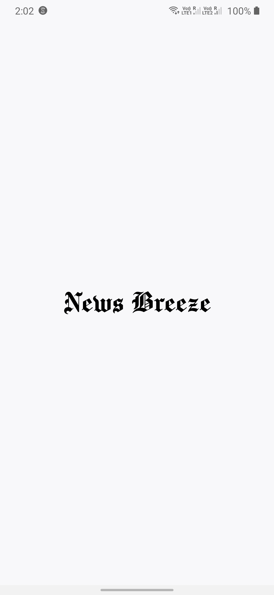
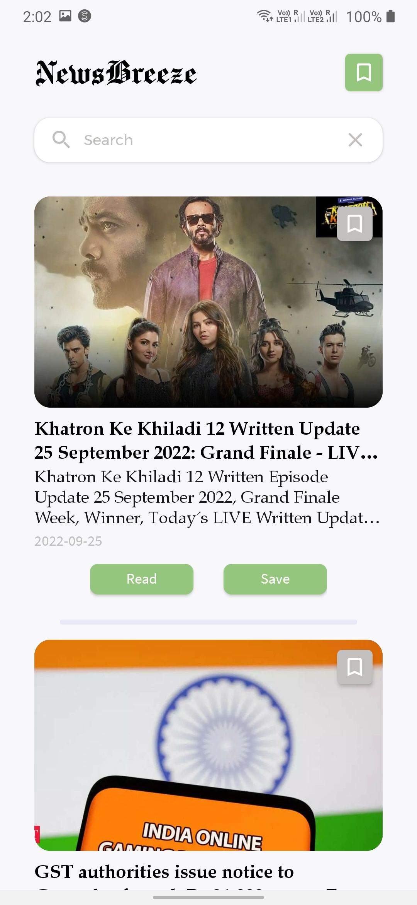

# NewsBreeze

### NewsBreeze is an unofficial newsApi client that gets the latest breaking news to you.

### Preview

   
   
    
    

## Features

● Get the latest breaking news articles and show them in a list

● Each article have an image, title, date and a short description

● On clicking on an article, it shows the full article

● All items in the list have a “save to read later” button which saves the articles
for reading later in a persistent format until the app is closed.

● The breaking news list have a search by title feature

● Save to read later have a list of all news saved and clicking on them shows
the full article.

## Tech Stack & Libraries
● API: All of the data is receiving from https://newsapi.org/

● Retrofit : Construct the REST APIs.

● SQLite : Storing the data for offline view

● Glide : An image loading and caching library for Android

● Postman: For testing the api.

Minimum SDK Level - 23

## Download APK
(https://drive.google.com/file/d/101J7qHvFtOh0O5c_ZJYHYN7HfRuv0eTc/view?usp=sharing) to download the latest APK.
